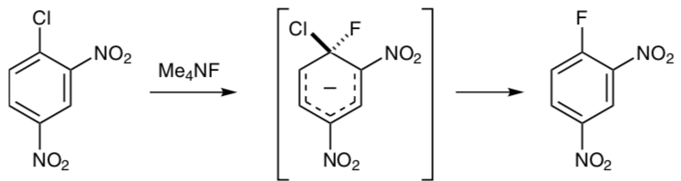

# Jprogdyn

*quasiclassical and classical dynamic with Gaussian*

## Contents
  - [Introduction](#introduction)
    - [Features](#features)
    - [Installation](#installation)
    - [Javadoc](#javadoc)
  
  - [Tutorials](#tutorials)
   - [Reaction Trajectory Tutorial](#reaction-trajectory-tutorial)
   - [NMR Trajectory Tutorial](#nmr-trajectory-tutorial)
   
  - [Notes](#notes)

  - [Fine Print](#fine-print)

## Introduction

*Jprogdyn* is an open-source Java program for running quasiclassical and classical dynamics calculations using the Gaussian electronic structure program.  *Jprogdyn* uses the normal modes from a standard Gaussian `freq` calculation to sample an initial structure from a given thermodynamic ensemble and calculates a trajectory using the [Velocity Verlet algorithm](https://en.wikipedia.org/wiki/Verlet_integration#Velocity_Verlet).  These trajectories can be used to study the free energy surfaces of reactions or calculate rovibrational corrections to NMR shieldings.

### Features

* compatible with Gaussian '09 and '16
* reaction trajectories
* rovibrational corrections to NMR shieldings
* quasiclassical or classical sampling of vibrations
* classical sampling of rotations
* arbitrary temperature
* parallel trajectories on one computer

### Installation

*Jprogdyn* requires Java 1.8 or later.  [Apache Maven](https://maven.apache.org/) is required to build *Jprogdyn*.  A working copy of [Gaussian](gaussian.com) and a Linux-like (Mac, Cygwin, Unix, or actual Linux) environment is required to run *Jprogdyn*.

The installation process is extremely easy:

1. Download and install [the Java Development Kit](https://www.oracle.com/technetwork/java/javase/downloads/index.html), [Maven](https://maven.apache.org/download.cgi), and [Gaussian](gaussian.com).
2. Clone this repository: `git clone https://github.com/ekwan/Jprogdyn.git`
3. Build the package: `mvn package`  This places the compiled classes in the `target` folder, but you should not have to manipulate the files there directly.
4. The `run_gaussian.sh` script in `Jprogdyn/gaussian` folder is the interface between *Jprogdyn* and the version of Gaussian on your system.  Please edit this script accordingly according to your system's requirements.  For example, you can adjust the scratch folder (`GAUSS_SCRDIR`) or the name/path of the Gaussian executable.

That's it!  If you encounter any problems during the build process, please let us know and we'll be glad to help you.

### Javadoc

*Jprogdyn* is open-source software and the code is extensively documented through a Javadoc.  To build the javadoc: `mvn javadoc:javadoc`  This will place the result in: `Jprogdyn/target/site/apidocs/edu/harvard/chemistry/ekwan/Jprogdyn/package-summary.html`.

## Tutorials

*Jprogdyn* can run trajectories for studying reactions or computing rovibrational corrections to NMR shifts.

### Reaction Trajectory Tutorial

In this tutorial, we reproduce the quasiclassical trajectory analysis in our [study](#ref1) of nucleophilic aromatic substitution reactions.  

This reaction was studied at B3LYP/6-31+G*/PCM and found to be concerted on the potential energy surface, but pseudo-stepwise on the free energy surface.

### NMR Trajectory Tutorial

In this tutorial, we reproduce the rovibrational correction to the NMR shifts of methane reported in our [2015 study](#ref2).  We will compute trajectories on the B3LYP/MIDI! surface, calculate NMR shieldings every 8 points using B3LYP/cc-pVDZ, and analyze the results to obtain the raw rovibrational corrections.  The reported values are: -4.22 ppm (13C) and -0.64 ppm (1H).

## Notes

This section describes some of the details of how Jprogdyn works and some of the potential issues that can arise.

### Input

Both reaction and NMR trajectories are initialized from the result of a Gaussian `freq=hpmodes` calculation.  (The extra precision from `hpmodes` is helpful for getting consistent results.)  Please ensure that the starting structure is a true stationary point on the dynamics surface.  Please also ensure that there is only one frequency job per file.  Small imaginary frequencies (e.g., due to DFT integration grid inaccuracies) should be avoided, but probably will not influence the results heavily.

### Quasiclassical Initialization

In quasiclassical initialization, each normal mode is randomly placed in a quantum harmonic oscillator eigenstate, with a probability that is appropriate to the specified temperature.  This determines the amount of total energy in the mode.  The displacement is chosen from the probability density function for the given eigenstate, which determines the partitioning between potential and kinetic energy for the mode.  For all but the softest modes, the most likely eigenstate by far is the ground state (at room temperature).

### Classical Initialization

Classical initialization uses the probability for a classical, rather than quantum mechanical, harmonic oscillator.  In general, quasiclassical trajectories are more realistic, but classical trajectories can be propagated longer (see section on Propagation below).

### Transition Modes

When initializing dynamics from a transition state to study a reaction, the velocity in the transition mode (i.e., the imaginary frequency) is generally set to be "forward."  Whether "forward" corresponds to a positive or negative sign in the transition mode is arbitrary.  You can determine this by animating the imaginary mode.  In GaussView, you can animate the imaginary mode by going to Results...Vibrations and using the "manual displacement" tool.  By moving the slider to the right, you can determine whether a positive displacement corresponds to a forward or backwards reaction.  In general, all reactions will have some degree of recrossing: some of these "forward" trajectories will end up at starting material.  Some reactions, such as the ones Professor Singleton and many others are interested in, have much more recrossing.  A full discussion of recrossing is beyond the scope of this file.

### Rotational Initialization

The molecule can also have rotational energy added to it from a classical distribution.  In principle, this could result in some centrifugal distortion that can alter the results.  In practice, we have found this makes very little difference.

### Initialization Tolerance

The frequencies provided to the initialization routine constitute a harmonic approximation to the potential energy surface.  In the stiffer modes (e.g., C-H stretches), this approximation is excellent in that displacing the molecule along the normal mode will increase the potential energy by the expected amount.  In softer modes (i.e., low frequencies), the surface may be much more anharmoic.

*Jprogdyn* always initializes trajectories harmonically, in that the predicted potential energy and the actual potential energy of the initially displaced structure must agree to within the specified tolerance level (specified in percent as a total of the absolute energy).  In some cases, it may be necessary to disable displacements in the lower frequency modes to prevent the initialization routine from straying into very anharmonic territory.  Note that the fact that *Jprogdyn* trajectories always start in harmonic regions of the potential energy surface does not preclude the trajectories from exploring anharmonic regions as they propagate.

### Propagation

Trajectories are propagated using the Velocity Verlet algorithm.  From Wikipedia:

In general, a timestep of 1.0 fs is a good compromise between speed (fewer trajectory points) and accuracy (avoiding integration error).  Quasiclassical trajectories should not be extended more than ~500 fs forwards or backwards, due to unphysical intramolecular vibrational redistribution.

### Analysis

MOLDEN

### Other Electronic Structure Programs

*Jprogdyn* has been written to interface with Gaussian, but it should be possible to modify it to work with other electronic structure programs as long as the same information (forces, frequencies, normal modes, reduced masses, etc.) is available.

## Fine Print

### Acknowledgements

This program is inspired by the `progdyn` suite of software written by Professor Daniel A. Singleton.  E.E.K. would like to express his gratitude to Professor Singleton for his mentorship and support over many years.

### References

1. "Concerted Nucleophilic Aromatic Substitutions."  Kwan, E.E.; Zeng, Y.; Besser, H.A.; Jacobsen, E.N.  *Nature Chem.* **2018**, *10*, 917&ndash;923.

2. "Enhancing NMR Prediction for Organic Compounds Using Molecular Dynamics."  Kwan, E.E.; Liu, R.Y.  *J. Chem. Theory Comput.*  **2015**, *11*, 5083&ndash;5089.

### Authors

*Jprogdyn* was written by Eugene Kwan and Richard Liu at the Department of Chemistry and Chemical Biology at Harvard University.

### Getting Help

Please email `ekwan16@gmail.com` with any questions.  We will gladly try to help you.

## How to Cite

Please cite [reference 2](#ref2).

## License
   
This project is licensed under the Apache License, Version 2.0. See `LICENSE.txt` for full terms and conditions.
   
*Copyright 2018 by Eugene E. Kwan and Richard Y. Liu*